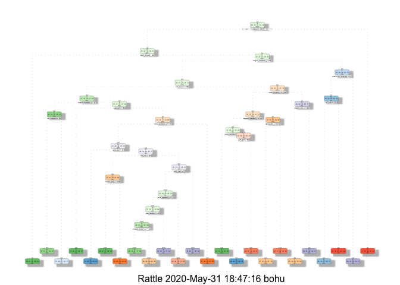

## Synopsis 

The basic goal of this paper is to use machine learning to help predict the class of movement for various excercises. This is also my submission for the course project for the Johns Hopkins Data Science Coursera course, Practical Machine Learning class.

At the end of the solution code, we can see that we have performed a random forest model on a test set of data which was unclassified.  This information was submitted online and found to be 100% accurate.  The final model was selected due to it's performance as the most accurate model.  That said, other models were attempted for comparison sake, and did offer comparable results with less computational complexity.

# Assignment Details 

Using devices such as Jawbone Up, Nike FuelBand, and Fitbit it is now possible to collect a large amount of data about personal activity relatively inexpensively. These type of devices are part of the quantified self movement - a group of enthusiasts who take measurements about themselves regularly to improve their health, to find patterns in their behavior, or because they are tech geeks. One thing that people regularly do is quantify how much of a particular activity they do, but they rarely quantify how well they do it. In this project, your goal will be to use data from accelerometers on the belt, forearm, arm, and dumbell of 6 participants. They were asked to perform barbell lifts correctly and incorrectly in 5 different ways. 

* Class A - exactly according to the specification  
* Class B - throwing the elbows to the front 
* Class C - lifting the dumbbell only halfway 
* Class D - lowering the dumbbell only halfway
* Class E - throwing the hips to the front 

More information is available from the website here: http://groupware.les.inf.puc-rio.br/har (see the section on the Weight Lifting Exercise Dataset).
http://groupware.les.inf.puc-rio.br/har#ixzz6NlPJegqA

# Solution Approach and Details


```r
# As we get started let us...  
# Set a working directory
setwd("~/Documents/1_KM/1- EdX_Coursera_Udemy_Moocs/JHDS - Practical Machine Learning/Final_Project-PML-JHDS")

# Clear the current workspace
rm(list=ls())                

# Set the seed
set.seed(007)

#install the necessary libraries
library(knitr, warn.conflicts = FALSE)
library(caret, warn.conflicts = FALSE) #will also install lattice, ggplot2
library(tidyr, warn.conflicts = FALSE)
library(randomForest, warn.conflicts = FALSE)
library(rattle, warn.conflicts = FALSE)
library(rpart, warn.conflicts = FALSE)
library(rpart.plot, warn.conflicts = FALSE)
library(gbm, warn.conflicts = FALSE)
```

# Load the data


```r
data_training <- read.csv(url("https://d396qusza40orc.cloudfront.net/predmachlearn/pml-training.csv"), header=TRUE, na.strings = c("NA", "#DIV/0!", ""))

data_testing <- read.csv(url("https://d396qusza40orc.cloudfront.net/predmachlearn/pml-testing.csv"), header=TRUE, na.strings = c("NA", "#DIV/0!", ""))

# FYI: na.strings = c("NA", "#DIV/0!", "") helps catch additional empty values other than explicit "NA's"

## If desired you can explore the data as follows...
# head(data_training)
# dim(data_training)
# str(data_training)
# summary(data_training)
```


## Data Preparation

```r
# Inspect for missing values

missing_values <- apply(data_training, 2, function(x) sum(is.na(x)/length(x))) 
# 2 indicates columns, 1 is rows, c(1,2) is ROWS AND COLUMNS...
#this returns a vector with the % of NA's in each variable column
 

#Remove columns
removeNA_training <- data_training[,colSums(is.na(data_training))==0]
removeNA_testing <- data_testing[,colSums(is.na(data_testing))==0]


dim(removeNA_training)
```

```
## [1] 19622    60
```

```r
#removes 100 variables that contain NA's
dim(removeNA_testing)
```

```
## [1] 20 60
```

```r
#removes 100 variables


# So now our training and test data sets contain 60 variable columns...However, we can also remove the first 7 variables that don't contain useful information.
# ( FYI - These rows include Timestamps, User information and window details)


## Setting up the final training, validation and testing data sets

training <- removeNA_training[, -c(1:7)]
testing <- removeNA_testing[, -c(1:7)]

dim(training)
```

```
## [1] 19622    53
```

```r
dim(testing)
```

```
## [1] 20 53
```

```r
# Here we can validate that the remaining variables are complete, and do not have missing values
table(complete.cases(training))
```

```
## 
##  TRUE 
## 19622
```

```r
# We are left with 53 variables.  The next step is to break these into training and testing data sets.

split_training <- createDataPartition(y=training$classe, p=0.7, list=FALSE)
in_training <- training[split_training, ] 
validation <- training[-split_training, ]
#str(training)

#Let's take a look at the classe variable we are attempting to predict
summary(training$classe)
```

```
##    A    B    C    D    E 
## 5580 3797 3422 3216 3607
```


# Prediction modeling methods

In the following chunks of code, I have trained models using gradient boosting, classification trees, and random forest.  I will however comment out these models with the expection of a random forest model where I have limited the number of trees. I've commented out these other models, due to the time it would take to reprocess them.  The full random forest model took over an hour, and I fell asleep the othernight while the gbm model was training, so not sure how long that ran for.   

I have however included the code as a reference, and have listed the accuracy from these models.  I will be returning to this script to explore additional tuning parameters for the GBM and RF models, in particular which were long running, but didn't have the time to complete this before submission of this assignment.


```r
#model_gbm   <- train(classe ~ ., data = in_training, method = "gbm")
model_classification_tree <- rpart(classe ~ ., data = in_training, method = "class")
#model_randomforest <- train(classe ~ ., data = in_training, method = "rf")
model2_randomforest <- train(classe ~ ., data = in_training, method = "rf", ntree = 3)


## Prediction

# Gradient Boosting Machine Model
# predict_gbm <- predict(model_gbm, validation)
# confusionMatrix(predict_gbm, validation$classe)
####  96.1% Accuracy

## Classification Tree Model
predict_classification_tree <- predict(model_classification_tree, validation, type = "class")
confusionMatrix(predict_classification_tree, validation$classe)
```

```
## Confusion Matrix and Statistics
## 
##           Reference
## Prediction    A    B    C    D    E
##          A 1519  191   21   57   10
##          B   42  551   43   67   71
##          C   37  235  870   88  167
##          D   60   72   89  671   69
##          E   16   90    3   81  765
## 
## Overall Statistics
##                                           
##                Accuracy : 0.7436          
##                  95% CI : (0.7322, 0.7547)
##     No Information Rate : 0.2845          
##     P-Value [Acc > NIR] : < 2.2e-16       
##                                           
##                   Kappa : 0.6753          
##                                           
##  Mcnemar's Test P-Value : < 2.2e-16       
## 
## Statistics by Class:
## 
##                      Class: A Class: B Class: C Class: D Class: E
## Sensitivity            0.9074  0.48376   0.8480   0.6961   0.7070
## Specificity            0.9337  0.95301   0.8915   0.9411   0.9604
## Pos Pred Value         0.8448  0.71189   0.6228   0.6982   0.8010
## Neg Pred Value         0.9621  0.88495   0.9652   0.9405   0.9357
## Prevalence             0.2845  0.19354   0.1743   0.1638   0.1839
## Detection Rate         0.2581  0.09363   0.1478   0.1140   0.1300
## Detection Prevalence   0.3055  0.13152   0.2374   0.1633   0.1623
## Balanced Accuracy      0.9206  0.71839   0.8697   0.8186   0.8337
```

```r
# 74.1% Accuracy

## Random Forest Model
# predict_randomforest <- predict(model_randomforest, validation)
# confusionMatrix(predict_randomforest , validation$classe)
####  99.3% Accuracy

## Random Forest limited to 3 trees
predict_randomforest2 <- predict(model2_randomforest, validation)
confusionMatrix(predict_randomforest2 , validation$classe)
```

```
## Confusion Matrix and Statistics
## 
##           Reference
## Prediction    A    B    C    D    E
##          A 1657   24    1    5    4
##          B   10 1084   15   13    9
##          C    2   19 1001   19    2
##          D    4   10    9  922    9
##          E    1    2    0    5 1058
## 
## Overall Statistics
##                                           
##                Accuracy : 0.9723          
##                  95% CI : (0.9678, 0.9763)
##     No Information Rate : 0.2845          
##     P-Value [Acc > NIR] : < 2e-16         
##                                           
##                   Kappa : 0.965           
##                                           
##  Mcnemar's Test P-Value : 0.02888         
## 
## Statistics by Class:
## 
##                      Class: A Class: B Class: C Class: D Class: E
## Sensitivity            0.9898   0.9517   0.9756   0.9564   0.9778
## Specificity            0.9919   0.9901   0.9914   0.9935   0.9983
## Pos Pred Value         0.9799   0.9584   0.9597   0.9665   0.9925
## Neg Pred Value         0.9959   0.9884   0.9948   0.9915   0.9950
## Prevalence             0.2845   0.1935   0.1743   0.1638   0.1839
## Detection Rate         0.2816   0.1842   0.1701   0.1567   0.1798
## Detection Prevalence   0.2873   0.1922   0.1772   0.1621   0.1811
## Balanced Accuracy      0.9909   0.9709   0.9835   0.9750   0.9881
```

```r
# ~97% Accuracy
```


## Conclusion

We can now apply the trained model to predict the class values on the test data set. Even with a less complex model, we were able to predict 95% of the classification variance. In the appendix, we can see that there are alternative methods to reduce complexity, but can expect that with a more expensive we can improve accuracy and reduce variance even further. 


```r
##  Final Model Validation 
#  Predicted Classification submitted online to validate answers, and was found to be 95% accurate (19 of 20 cases predicted successfully).

# However the full (unrestricted) random forest was able to correctly predict all 20 cases.

final_testing <- predict(model2_randomforest, testing)
final_testing 
```

```
##  [1] B A B A A E D B A A B C B A E E A B B B
## Levels: A B C D E
```


## Appendix

We can see here a visualization of the classification tree model.

```r
fancyRpartPlot(model_classification_tree)
```

<!-- -->


# Variable Selection

I ended up using all 53 variables in my prediction models, but given more time to optimize performance, I would limit the number of variables to help minimize the computational expense.

Below we can see how using Priciple Component Analysis, we can explain 95% of the variance with only 25 of the variables.

I ended up being able to explain greater than 95% variance with a more expensive model.


```r
PCA <- preProcess(in_training, method="pca", thresh=0.95)
PCA
```

```
## Created from 13737 samples and 53 variables
## 
## Pre-processing:
##   - centered (52)
##   - ignored (1)
##   - principal component signal extraction (52)
##   - scaled (52)
## 
## PCA needed 25 components to capture 95 percent of the variance
```
